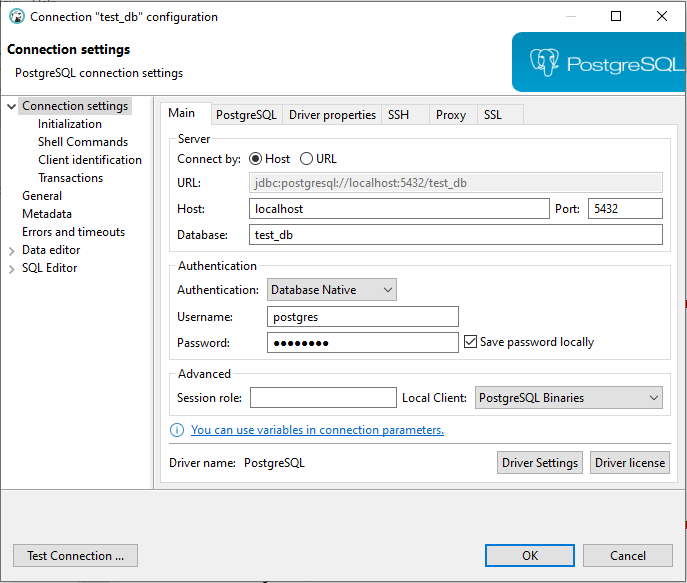

# Votação API REST
**Java version 17**

**Spring version 3.3.0**

---

* **Objetivo**

O sistema consiste em ser uma solução para gerenciar votações de pautas sobre qualquer assunto, ajudando de uma forma mais prática e fácil.

---

* **Preparando o ambiente**

É necessário baixar o Docker Desktop -> https://www.docker.com/products/docker-desktop/
depois vá na raiz do projeto vai ver o arquivo docker-compose.yml, usando qualquer cmd
na pasta onde se encontra o arquivo digite **docker-compose up** depois verifique se a imagem do postgreSql apareceu.

---

Também é necessário uma ferramenta de SGBD, ou qualquer outra do seu gosto, abaixo segue o link:
https://dbeaver.io/download/

Abrir o DBeaver e criar nova conexão.
Na janela que abrir, deve ser inserida as informações da conexão nos campos:

 - a) Host: localhost
 - b) Database: test_db
 - c) Port: 5432
 - d) Username: postgres
 - e) Password: postgres

Obs: não é preciso criar as tabelas
```
  jpa:
    hibernate:
      ddl-auto: update
      
```


---

### Endpoints Swagger


http://localhost:8080/swagger-ui/index.html#/

---

Postman

* **POST**<br />
Criar uma pauta http://localhost:8080/pauta/create <br />Exemplo payload
```
 {
        "pauta": "pauta lei 4.2.1"
        
    }
```
---
* **POST**<br />
Criar uma sessão de votação http://localhost:8080/voting-session/create/{idPauta} <br />Exemplo payload
```
{
  "closeSession": "2024-06-02T16:20:33"
}
```
---
* **POST**<br />
Registrar seu voto na pauta http://localhost:8080/vote/register/{idPauta} <br />Exemplo payload
```
{
  "cpfAssociate": "278.100.930-02",
  "messageVote": "Sim"
}
```

---


* **GET**<br />Pegar o resultado da votação. Obs -> Só pode pegar o resultado da votação quando terminar o tempo de votação http://localhost:8080/vote/result/{idPauta} <br />

* **GET**<br />Valida se vc está apto para votar. Obs esse é o endpoint integrado com o sistema externo da inverText http://localhost:8080/vote/users/{cpf} <br />


---

Tarefa Bônus integrando com um sistema externo da https://api.invertexto.com/api-validador-cpf-cnpj para validar cpf
```
@FeignClient(name = "inver-texto-api", url = "${application.client.inver-texto-api.url}")
public interface InverTextoApiClient {

    @GetMapping(consumes = MediaType.APPLICATION_JSON_VALUE)
    ValidResponse validCpf(@RequestParam(name = "token") String token, @RequestParam(name = "value") String value, @RequestParam(name = "type") String type);

}

```


